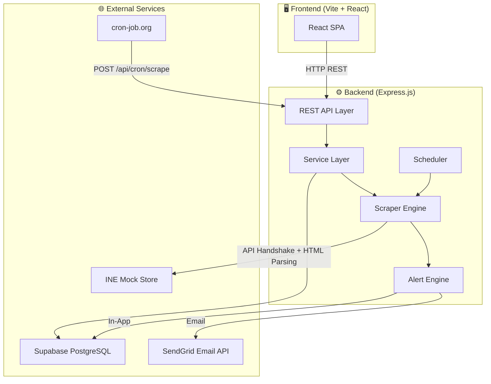
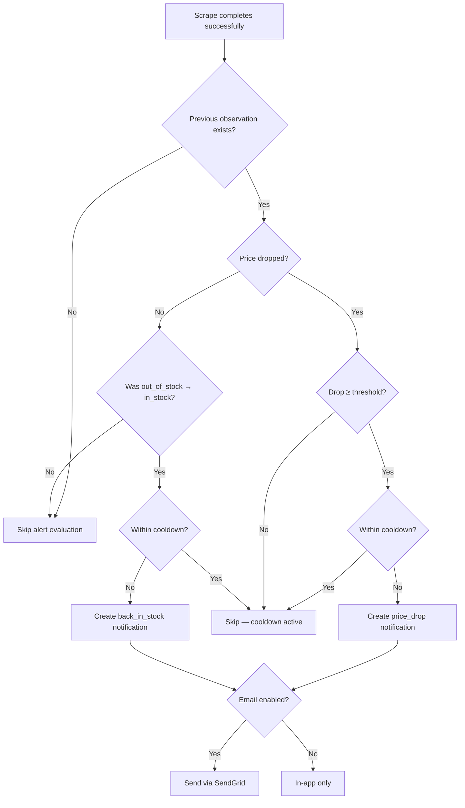
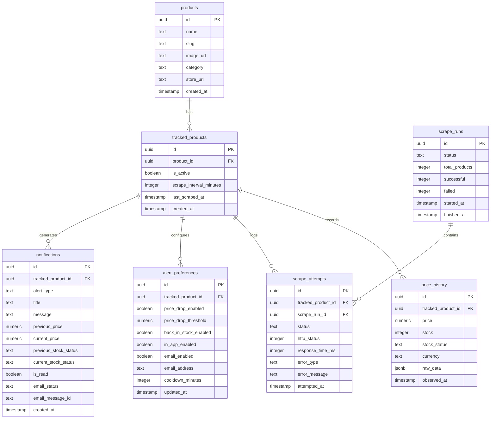
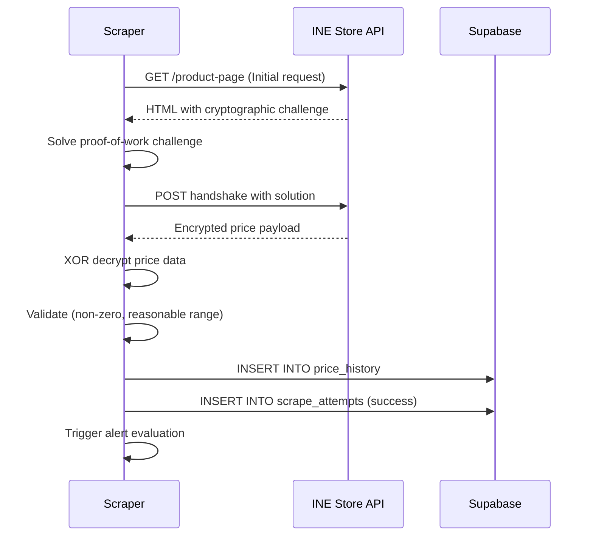
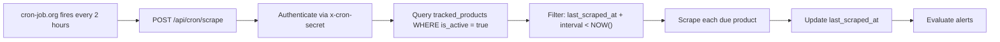

# 🛍️ ProductPulse — Backend

> **Real-time product price & stock tracking engine** for the INE mock storefront.
> Scrapes product data, detects price drops & restocks, and notifies you via in-app alerts and SendGrid email — all from one backend.

---

## 📑 Table of Contents

- [Features at a Glance](#-features-at-a-glance)
- [Architecture](#-architecture)
- [Project Structure](#-project-structure)
- [Tech Stack](#-tech-stack)
- [Getting Started](#-getting-started)
- [Environment Variables](#-environment-variables)
- [Database Schema (Supabase)](#-database-schema-supabase)
- [API Reference](#-api-reference)
- [Alert & Notification System](#-alert--notification-system)
- [Scraper Engine](#-scraper-engine)
- [Scheduler & Cron](#-scheduler--cron)
- [Deployment](#-deployment)
- [Scripts](#-scripts)

---

## ✨ Features at a Glance

| Feature | Description |
|---|---|
| **Product Discovery** | Search 1,000 products from the INE storefront; full catalog sync to Supabase |
| **Price Tracking** | Track any product with configurable scrape frequency (default 120 min) |
| **Price-Drop Alerts** | Automatic detection with customizable threshold (e.g. alert only if drop > ₹500) |
| **Back-in-Stock Alerts** | Triggers when a product transitions from `out_of_stock` → `in_stock` |
| **In-App Notifications** | Real-time bell icon with unread count, mark-read, and click-to-navigate |
| **Email Alerts (SendGrid)** | Beautiful HTML emails with warm, human-friendly language |
| **Change Detection** | Flags structural HTML changes on the store's product pages |
| **Configurable Frequency** | Per-product scrape interval via `PATCH /api/tracked-products/:id` |
| **Scrape Logging** | Every attempt logged with response time, HTTP status, and error classification |
| **Data Validation** | Rejects corrupted, zero, or invalid prices before insertion |
| **Cooldown Windows** | Prevents alert spam with configurable cooldown per alert type |

---

## 🏗️ Architecture

### High-Level Overview



### Alert Flow (After Each Scrape)



---

## 📂 Project Structure

```
Backend/
├── .env                          # Environment variables (not committed)
├── package.json                  # Dependencies & scripts
├── all_products.json             # Full catalog cache (1,000 products)
│
├── Scheduler/                    # Autonomous scrape scheduler
│   ├── index.js                  # runDueScrapes() entry point
│   ├── run.js                    # CLI runner for due scrapes
│   └── Models/
│       └── trackedProducts.js    # Queries for due-for-scrape products
│
├── Scraper/                      # Legacy Playwright-based scraper
│   └── ...
│
├── scripts/                      # Utility scripts
│   ├── sync-products.js          # Sync all_products.json → Supabase
│   └── test-products.js          # Product data tests
│
├── debug/                        # Development debug tools
│   └── scrape.js                 # Manual scrape debug runner
│
└── src/                          # Main application source
    ├── server.js                 # HTTP server bootstrap
    ├── app.js                    # Express app (CORS, routes, middleware)
    │
    ├── config/
    │   ├── env.js                # Centralized env var parsing & defaults
    │   └── supabase.js           # Supabase client singleton
    │
    ├── routes/
    │   ├── index.js              # Route registration hub
    │   ├── health.routes.js      # Health check
    │   ├── product.routes.js     # Product search, catalog, sync
    │   ├── tracking.routes.js    # CRUD for tracked products + sub-routes
    │   ├── scrape.routes.js      # Manual & cron scrape triggers
    │   ├── scheduler.routes.js   # Scheduler status & manual trigger
    │   ├── notification.routes.js# Notification list & mark-read
    │   ├── alert.routes.js       # Alert preference management
    │   └── history.routes.js     # Price/stock history & scrape logs
    │
    ├── controllers/
    │   ├── product.controller.js     # Products: list, search, getById, sync
    │   ├── tracking.controller.js    # Tracking: list, track, untrack, update
    │   ├── scrape.controller.js      # Scraping: manual trigger, cron, scheduler
    │   ├── history.controller.js     # History: price, stock, scrape logs
    │   ├── alert.controller.js       # Alert preferences: get, update
    │   └── notification.controller.js# Notifications: list, markRead, markAllRead
    │
    ├── services/
    │   ├── product.service.js     # Product CRUD, search, catalog sync
    │   ├── tracking.service.js    # Tracker lifecycle (track/untrack/update)
    │   ├── scrape.service.js      # Core scrape orchestration & validation
    │   ├── history.service.js     # Price/stock history queries
    │   ├── log.service.js         # Scrape attempt logging
    │   ├── alertService.js        # Alert evaluation logic & cooldowns
    │   ├── notificationService.js # Supabase notification CRUD + email dispatch
    │   └── emailService.js        # SendGrid email sending wrapper
    │
    ├── scraper/
    │   ├── scraper.js             # API-based handshake scraper
    │   ├── retry.js               # Retry logic with backoff
    │   ├── parser.js              # HTML response parser (Cheerio)
    │   └── validator.js           # Price/stock data validation
    │
    ├── middleware/
    │   ├── error.middleware.js     # Global error handler
    │   ├── cron.middleware.js      # x-cron-secret header auth
    │   └── validation.middleware.js# UUID param validation (Zod)
    │
    └── utils/
        ├── logger.js              # Structured console logger
        ├── normalize.js           # Data normalization helpers
        └── response.js            # Standardized API response helpers
```

---

## 🔧 Tech Stack

| Layer | Technology | Purpose |
|---|---|---|
| **Runtime** | Node.js (ES Modules) | Server-side JavaScript |
| **Framework** | Express.js v5 | REST API framework |
| **Database** | Supabase (PostgreSQL) | Persistent storage, real-time queries |
| **Scraping** | Cheerio + Custom API Handshake | HTML parsing & price extraction |
| **Email** | SendGrid (`@sendgrid/mail`) | Transactional alert emails |
| **Validation** | Zod | Request & data validation |
| **Rate Limiting** | `express-rate-limit` | API abuse prevention |
| **WebSocket** | `ws` | Real-time communication |
| **Dev Tools** | Nodemon, Playwright (debug) | Hot reload, browser scraping fallback |

---

## 🚀 Getting Started

### Prerequisites

- **Node.js** ≥ 18.x
- **npm** ≥ 9.x
- A **Supabase** project (free tier works fine)
- A **SendGrid** account (for email alerts — optional)

### 1. Install Dependencies

```bash
cd Backend
npm install
```

### 2. Configure Environment

Copy `.env.example` or create `.env` in the `Backend/` directory (see [Environment Variables](#-environment-variables)).

### 3. Sync the Product Catalog

```bash
npm run db:sync
```

> [!TIP]
> This reads from `all_products.json` (1,000 products) and upserts them into the Supabase `products` table. You can also trigger this from the frontend via the **Sync Catalog** button.

### 4. Start the Development Server

```bash
npm run dev
```

The server starts on `http://localhost:5000` with hot-reload via Nodemon.

### 5. (Production) Start the Server

```bash
npm start
```

---

## ⚙️ Environment Variables

Create a `.env` file in the `Backend/` directory:

```env
# ── Server ──────────────────────────────────────────
PORT=5000
NODE_ENV=development

# ── Supabase ────────────────────────────────────────
SUPABASE_URL=https://your-project.supabase.co
SUPABASE_SERVICE_ROLE_KEY=your-service-role-key

# ── Target Store ────────────────────────────────────
STORE_BASE_URL=https://demo.inelabteamdev.com

# ── Scraper Tuning ──────────────────────────────────
SCRAPER_HEADLESS=true
SCRAPER_MAX_ATTEMPTS=3
SCRAPER_NAVIGATION_TIMEOUT=30000
SCRAPER_REVEAL_TIMEOUT=20000
MAX_CONCURRENT_SCRAPES=2

# ── Security & CORS ────────────────────────────────
CORS_ORIGIN=http://localhost:5173
CRON_SECRET=your-secret-cron-token
FRONTEND_URL=http://localhost:5173

# ── SendGrid Email (Optional) ──────────────────────
SENDGRID_API_KEY=SG.your-sendgrid-api-key
SENDGRID_FROM_EMAIL=alerts@yourdomain.com
```

> [!IMPORTANT]
> **SendGrid Setup**: Your API key **must** have `Mail Send` permission (or Full Access). You must also verify the sender email via **Sender Identity** in SendGrid's dashboard. Without DKIM/SPF alignment, emails may land in spam.

| Variable | Default | Required | Description |
|---|---|---|---|
| `PORT` | `5000` | No | Server listen port |
| `NODE_ENV` | `development` | No | `development` or `production` |
| `SUPABASE_URL` | — | **Yes** | Your Supabase project URL |
| `SUPABASE_SERVICE_ROLE_KEY` | — | **Yes** | Supabase service role key (server-side) |
| `STORE_BASE_URL` | `https://demo.inelabteamdev.com` | No | Target storefront base URL |
| `SCRAPER_HEADLESS` | `true` | No | Run Playwright in headless mode |
| `SCRAPER_MAX_ATTEMPTS` | `3` | No | Max retry attempts per scrape |
| `SCRAPER_NAVIGATION_TIMEOUT` | `30000` | No | Page navigation timeout (ms) |
| `SCRAPER_REVEAL_TIMEOUT` | `20000` | No | Price reveal element timeout (ms) |
| `MAX_CONCURRENT_SCRAPES` | `2` | No | Parallel scrape concurrency limit |
| `CORS_ORIGIN` | `http://localhost:5173` | No | Allowed CORS origin |
| `CRON_SECRET` | `productpulse-cron-secret-key` | No | Secret for cron endpoint auth |
| `FRONTEND_URL` | `http://localhost:5173` | No | Frontend URL for email links |
| `SENDGRID_API_KEY` | — | No | SendGrid API key for email alerts |
| `SENDGRID_FROM_EMAIL` | `alerts@productpulse.com` | No | Verified sender email address |

---

## 🗄️ Database Schema (Supabase)



### Key Tables Explained

| Table | Purpose |
|---|---|
| `products` | Master catalog of all 1,000 products from the INE store |
| `tracked_products` | Products being actively monitored; `is_active` controls soft-deactivation |
| `price_history` | Every successfully scraped price observation with stock status |
| `scrape_runs` | Groups of scrape attempts (one run per cron trigger) |
| `scrape_attempts` | Individual scrape attempt logs with timing and error details |
| `alert_preferences` | Per-product notification configuration (thresholds, channels, cooldown) |
| `notifications` | Generated alerts — both in-app and email delivery records |

---

## 📡 API Reference

All endpoints are prefixed with `/api`.

### 🩺 Health

| Method | Endpoint | Description |
|---|---|---|
| `GET` | `/api/health` | Service health check |

---

### 📦 Products

| Method | Endpoint | Description |
|---|---|---|
| `GET` | `/api/products` | List all products (paginated) |
| `GET` | `/api/products/search?q=domus` | Search products by name across DB + live store |
| `GET` | `/api/products/:id` | Get product details, tracking status, and latest price |
| `POST` | `/api/products/sync` | Sync catalog from `all_products.json` → Supabase |

---

### 🎯 Tracked Products

| Method | Endpoint | Description |
|---|---|---|
| `GET` | `/api/tracked-products` | List all active tracked products with latest prices |
| `POST` | `/api/tracked-products` | Start tracking a product |
| `DELETE` | `/api/tracked-products/:id` | Untrack a product (soft-deactivation — sets `is_active: false`) |
| `PATCH` | `/api/tracked-products/:id` | Update tracking config (e.g., scrape frequency) |

**POST body:**
```json
{
  "productId": "uuid-of-product-to-track"
}
```

**PATCH body:**
```json
{
  "scrape_interval_minutes": 60
}
```

> [!NOTE]
> **Soft Deactivation**: Deleting a tracked product does NOT remove historical data. It sets `is_active: false` so all price history, scrape logs, and notifications are preserved for future reference.

---

### 📈 History & Logs

| Method | Endpoint | Description |
|---|---|---|
| `GET` | `/api/tracked-products/:id/history` | Full price observation history |
| `GET` | `/api/tracked-products/:id/price-history` | Chart-ready array: `[{ timestamp, price }]` |
| `GET` | `/api/tracked-products/:id/stock-history` | Stock history: `[{ timestamp, stock, status }]` |
| `GET` | `/api/tracked-products/:id/scrape-logs` | Scrape attempt logs with timing & errors |
| `GET` | `/api/tracked-products/:id/status` | Latest tracking status summary |

---

### 🔔 Alerts & Notifications

| Method | Endpoint | Description |
|---|---|---|
| `GET` | `/api/tracked-products/:id/alerts` | Get alert preferences for a tracked product |
| `PUT` | `/api/tracked-products/:id/alerts` | Update alert preferences |
| `GET` | `/api/notifications` | List all notifications (newest first) |
| `PATCH` | `/api/notifications/:id/read` | Mark a single notification as read |
| `PATCH` | `/api/notifications/read-all` | Mark all notifications as read |

**PUT alert preferences body:**
```json
{
  "priceDropEnabled": true,
  "priceDropThreshold": 500,
  "backInStockEnabled": true,
  "inAppEnabled": true,
  "emailEnabled": true,
  "emailAddress": "user@example.com",
  "cooldownMinutes": 120
}
```

---

### 🔍 Scraping

| Method | Endpoint | Auth | Description |
|---|---|---|---|
| `POST` | `/api/scrape/product/:trackedProductId` | None | Manually trigger a scrape for one product |
| `POST` | `/api/cron/scrape` | `x-cron-secret` header | External cron trigger for all due products |
| `POST` | `/api/scrape/run-due` | None | Run all products due for scraping |

---

### ⏰ Scheduler

| Method | Endpoint | Description |
|---|---|---|
| `GET` | `/api/scheduler/run-due` | Trigger due scrapes (supports `?force=true`) |
| `POST` | `/api/scheduler/run-due` | Trigger due scrapes (body `{ "force": true }`) |
| `GET` | `/api/scheduler/due` | List products currently due for scraping |

---

## 🔔 Alert & Notification System

### How It Works

The alert system is **deeply integrated into the scraper flow** but designed so that **alert/email failures never block core scraping**.

```
Successful Scrape
     │
     ├─ 1. Save price to price_history
     │
     ├─ 2. alertService.evaluateAlerts()
     │       ├─ Load alert_preferences
     │       ├─ Compare current vs previous observation
     │       ├─ Check cooldown windows
     │       └─ Create notification record
     │
     └─ 3. notificationService.createNotification()
             ├─ Insert into notifications table (in-app)
             └─ If email_enabled → emailService.sendAlertEmail() (SendGrid)
```

### Alert Types

| Alert Type | Trigger Condition | Example |
|---|---|---|
| `price_drop` | Current price < previous price **AND** drop ≥ threshold | Price went from ₹15,000 → ₹12,000 (drop of ₹3,000) |
| `back_in_stock` | Previous status was `out_of_stock`, current is `in_stock` | A sold-out product becomes available again |

### Cooldown System

Each alert type has an independent cooldown window (default: 120 minutes). This prevents notification spam when prices fluctuate rapidly. The cooldown is checked against the most recent notification of that type for that specific tracked product.

### Email Delivery

- **Provider**: SendGrid (via `@sendgrid/mail`)
- **Sender**: `ProductPulse Alerts <alerts@yourdomain.com>`
- **Format**: Rich HTML emails with a warm, conversational tone
- **Spam Prevention**: Configure DKIM/SPF records in your DNS and verify Sender Identity in SendGrid

---

## 🕷️ Scraper Engine

The scraper uses a **custom API-based handshake** (not browser automation) to extract real-time prices from the INE mock store.

### Scrape Pipeline



### Key Components

| File | Responsibility |
|---|---|
| `scraper/scraper.js` | API handshake orchestration |
| `scraper/retry.js` | Exponential backoff retry logic |
| `scraper/parser.js` | HTML parsing with Cheerio |
| `scraper/validator.js` | Price/stock data validation |

### Configuration

| Setting | Default | Description |
|---|---|---|
| `SCRAPER_MAX_ATTEMPTS` | 3 | Max retries before marking a scrape as failed |
| `SCRAPER_NAVIGATION_TIMEOUT` | 30s | HTTP request timeout |
| `SCRAPER_REVEAL_TIMEOUT` | 20s | Price reveal element timeout |
| `MAX_CONCURRENT_SCRAPES` | 2 | Max parallel scrapes (prevents rate limiting) |

---

## ⏰ Scheduler & Cron

### How Scheduling Works

Each tracked product has a `scrape_interval_minutes` field (default: 120). The scheduler compares `last_scraped_at + scrape_interval_minutes` against the current time to determine which products are "due".



### Setting Up cron-job.org

1. Go to [cron-job.org](https://cron-job.org) and create a free account
2. Create a new cron job with:

| Setting | Value |
|---|---|
| **URL** | `https://your-backend.onrender.com/api/cron/scrape` |
| **Method** | `POST` |
| **Schedule** | `0 */2 * * *` (every 2 hours) |
| **Header** | `x-cron-secret: your-secret-cron-token` |

> [!WARNING]
> The cron endpoint **requires** the `x-cron-secret` header to match the `CRON_SECRET` environment variable. Requests without this header receive a `403 Forbidden` response.

---

## 🚢 Deployment

### Deploy to Render

1. Create a **Web Service** on [Render](https://render.com)
2. Connect your GitHub repository
3. Configure:

| Setting | Value |
|---|---|
| **Root Directory** | `Backend` |
| **Build Command** | `npm install` |
| **Start Command** | `npm start` |
| **Node Version** | `18+` |

4. Add all environment variables from the [Environment Variables](#-environment-variables) section
5. Deploy 🚀

### Post-Deployment Checklist

- [ ] Environment variables are set in Render dashboard
- [ ] Supabase tables are created with the correct schema
- [ ] Product catalog is synced (`POST /api/products/sync`)
- [ ] SendGrid sender identity is verified (if using email alerts)
- [ ] cron-job.org is configured with the correct URL and secret
- [ ] CORS origin is set to your frontend's deployed URL

---

## 📜 Scripts

| Script | Command | Description |
|---|---|---|
| **Start** | `npm start` | Start the production server |
| **Dev** | `npm run dev` | Start with hot-reload (Nodemon) |
| **Sync DB** | `npm run db:sync` | Sync `all_products.json` → Supabase |
| **Test API** | `npm run test:api` | Run API integration tests |
| **Test Products** | `npm run test:products` | Run product data tests |
| **Debug Scrape** | `npm run debug:scrape` | Manual scrape debug runner |
| **Scheduler** | `npm run scheduler:run` | Run the due-scrape scheduler manually |

---

<p align="center">
  Built with ❤️ for ProductPulse
</p>
