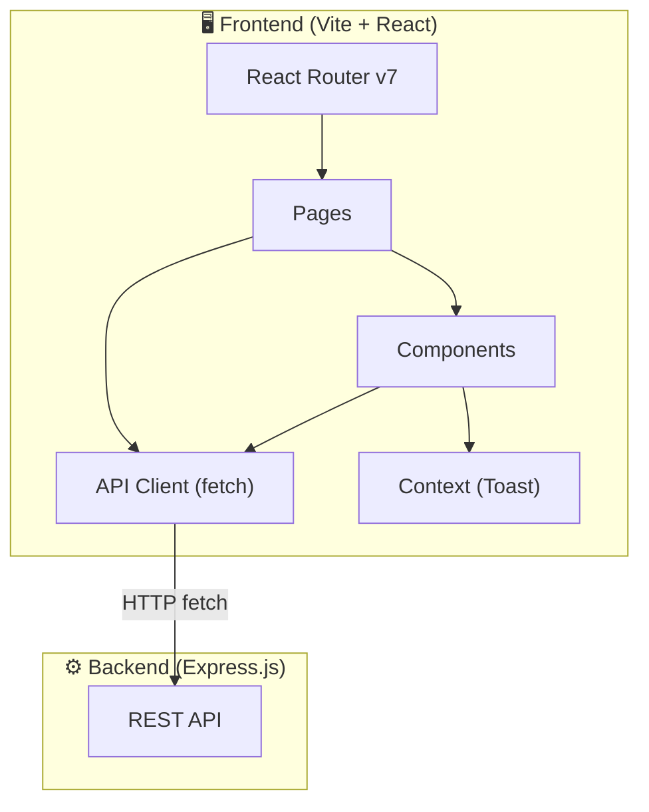
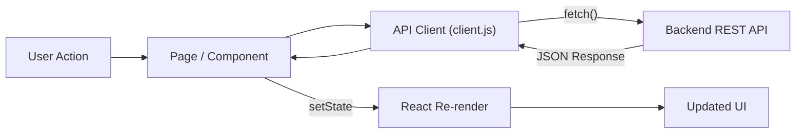
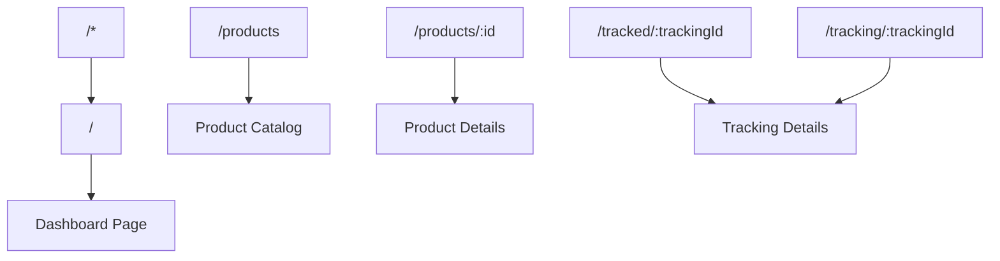

# 🖥️ ProductPulse — Frontend

> **A modern React dashboard** for tracking product prices, stock availability, and receiving real-time alerts — built with Vite, TailwindCSS, and Recharts.

---

## 📑 Table of Contents

- [Features](#-features)
- [Screenshots](#-screenshots)
- [Architecture](#-architecture)
- [Project Structure](#-project-structure)
- [Tech Stack](#-tech-stack)
- [Getting Started](#-getting-started)
- [Environment Variables](#-environment-variables)
- [Pages & Routing](#-pages--routing)
- [Components](#-components)
- [API Client](#-api-client)
- [Deployment](#-deployment)
- [Scripts](#-scripts)

---

## ✨ Features

| Feature | Description |
|---|---|
| **Dashboard Overview** | At-a-glance summary of all tracked products with prices, stock status, and last scrape time |
| **Product Catalog** | Browse, search, and filter all 1,000 products from the INE store |
| **Catalog Sync** | One-click sync button to refresh the full product catalog from the backend |
| **Product Details** | Detailed view with price, stock, description, and one-click tracking |
| **Tracking Details** | Deep-dive into a tracked product with price charts, stock history, scrape logs, and alert settings |
| **Price Charts** | Interactive line charts (Recharts) showing historical price trends |
| **In-App Notifications** | Bell icon with unread count, dropdown panel, click-to-navigate to the tracked product |
| **Alert Configuration** | Per-product settings: price-drop threshold, back-in-stock toggle, email alerts, cooldown |
| **Manual Scrape** | Trigger an immediate scrape from the tracking details page |
| **Toast Notifications** | Contextual success/error toasts for user actions |
| **Responsive Layout** | Sidebar navigation with collapsible topbar for clean UX |
| **Dark Theme** | Sleek dark-mode design with gradient accents |

---

## 🏗️ Architecture



### Data Flow



---

## 📂 Project Structure

```
Frontend/
├── .env                        # Environment variables
├── index.html                  # HTML entry point
├── vite.config.js              # Vite configuration
├── eslint.config.js            # ESLint configuration
├── package.json                # Dependencies & scripts
│
├── public/                     # Static assets
│
└── src/
    ├── main.jsx                # React DOM entry point
    ├── App.jsx                 # Root component — routing & layout
    ├── App.css                 # Global application styles
    ├── index.css               # Tailwind base imports
    │
    ├── api/
    │   └── client.js           # Centralized API client (all backend calls)
    │
    ├── components/
    │   ├── Layout.jsx           # Page shell (Sidebar + Topbar + content)
    │   ├── Sidebar.jsx          # Left nav with route links & active state
    │   ├── Topbar.jsx           # Top header bar with title & notification bell
    │   ├── NotificationBell.jsx # Bell icon, dropdown, unread count, click-nav
    │   ├── TrackedCard.jsx      # Dashboard card for each tracked product
    │   ├── PriceChart.jsx       # Recharts line chart for price history
    │   ├── ObservationsTable.jsx# Table of raw price/stock observations
    │   ├── ScrapeLogTable.jsx   # Table of scrape attempt logs
    │   ├── AlertSettings.jsx    # Alert preferences form (per tracked product)
    │   └── Modal.jsx            # Reusable modal dialog
    │
    ├── pages/
    │   ├── Dashboard.jsx        # Main dashboard — tracked product overview
    │   ├── Products.jsx         # Full product catalog with search & sync
    │   ├── ProductDetails.jsx   # Single product view with track/untrack
    │   └── TrackingDetails.jsx  # Tracked product deep-dive (charts, logs, alerts)
    │
    ├── context/
    │   └── ToastContext.jsx     # Global toast notification provider
    │
    ├── utils/
    │   └── format.js            # Formatting helpers (currency, dates, etc.)
    │
    └── assets/                  # Static images and icons
```

---

## 🔧 Tech Stack

| Layer | Technology | Purpose |
|---|---|---|
| **Build Tool** | Vite v8 | Lightning-fast dev server & bundler |
| **UI Library** | React v19 | Component-based UI |
| **Routing** | React Router v7 | Client-side navigation |
| **Styling** | TailwindCSS v4 | Utility-first CSS framework |
| **Charts** | Recharts v3 | Interactive data visualization |
| **Icons** | Lucide React | Beautiful, consistent SVG icons |
| **HTTP** | Native `fetch` | API communication (no Axios) |
| **Linting** | ESLint v10 | Code quality enforcement |

---

## 🚀 Getting Started

### Prerequisites

- **Node.js** ≥ 18.x
- **npm** ≥ 9.x
- The **Backend** server running on `http://localhost:5000` (see [Backend README](../Backend/README.md))

### 1. Install Dependencies

```bash
cd Frontend
npm install
```

### 2. Configure Environment

Create a `.env` file (see [Environment Variables](#-environment-variables)).

### 3. Start the Dev Server

```bash
npm run dev
```

The app opens at `http://localhost:5173` with hot module replacement (HMR).

---

## ⚙️ Environment Variables

Create a `.env` file in the `Frontend/` directory:

```env
VITE_API_BASE_URL=http://localhost:5000/api
```

| Variable | Default | Description |
|---|---|---|
| `VITE_API_BASE_URL` | `http://localhost:5000/api` | Backend API base URL |

> **Note:** For production deployment, set this to your deployed backend URL (e.g., `https://productpulse-backend.onrender.com/api`).

---

## 🗺️ Pages & Routing



| Route | Page | Description |
|---|---|---|
| `/` | `Dashboard` | Overview of all tracked products with status cards, summary stats |
| `/products` | `Products` | Full catalog (1,000 products), search, filter, pagination, sync button |
| `/products/:id` | `ProductDetails` | Single product view — price, stock, image, track/untrack action |
| `/tracked/:trackingId` | `TrackingDetails` | Deep-dive: price chart, stock history, scrape logs, alert settings, manual scrape |
| `/tracking/:trackingId` | `TrackingDetails` | Alias route (used by notification click-to-navigate) |
| `/*` | Redirect → `/` | Catch-all redirect to dashboard |

---

## 🧩 Components

### Layout Components

| Component | File | Description |
|---|---|---|
| **Layout** | `Layout.jsx` | Page wrapper — renders Sidebar, Topbar, and page content |
| **Sidebar** | `Sidebar.jsx` | Left navigation with links to Dashboard, Products; highlights active route |
| **Topbar** | `Topbar.jsx` | Top bar with page title and notification bell |

### Feature Components

| Component | File | Description |
|---|---|---|
| **NotificationBell** | `NotificationBell.jsx` | 🔔 Bell icon in the topbar. Shows unread count badge, opens dropdown with recent notifications, supports "Mark all read", and navigates to the tracked product on click |
| **TrackedCard** | `TrackedCard.jsx` | Dashboard card showing product name, image, current price, stock status, last scrape time, and quick navigation to tracking details |
| **PriceChart** | `PriceChart.jsx` | Interactive Recharts line chart displaying price history over time with tooltips and responsive sizing |
| **ObservationsTable** | `ObservationsTable.jsx` | Sortable table of raw price/stock observations with timestamps |
| **ScrapeLogTable** | `ScrapeLogTable.jsx` | Table showing scrape attempt logs — status, HTTP code, response time, error details |
| **AlertSettings** | `AlertSettings.jsx` | Configuration form for per-product alerts: price-drop enable/threshold, back-in-stock toggle, email toggle/address, cooldown minutes |
| **Modal** | `Modal.jsx` | Generic reusable modal with overlay, close button, and customizable content |

### Context

| Provider | File | Description |
|---|---|---|
| **ToastContext** | `ToastContext.jsx` | Global toast notification system — `useToast()` hook provides `showSuccess()` and `showError()` methods |

---

## 📡 API Client

All backend communication is centralized in [`src/api/client.js`](src/api/client.js). It uses native `fetch` with automatic timeout handling and standardized error extraction.

### Available API Modules

| Module | Methods | Description |
|---|---|---|
| `healthApi` | `check()` | Backend health check |
| `productsApi` | `list()`, `search()`, `getById()`, `syncCatalog()` | Product catalog operations |
| `trackingApi` | `list()`, `track()`, `untrack()`, `update()` | Tracked product lifecycle |
| `historyApi` | `getPriceHistory()`, `getStockHistory()`, `getObservations()`, `getScrapeLogs()`, `getStatus()` | Historical data queries |
| `scrapeApi` | `scrapeNow()`, `runDue()` | Manual scrape triggers |
| `alertsApi` | `getPreferences()`, `updatePreferences()` | Alert configuration |
| `notificationsApi` | `list()`, `markAsRead()`, `markAllAsRead()` | Notification management |

### Usage Example

```jsx
import { productsApi, trackingApi } from '../api/client';

// Search products
const results = await productsApi.search('domus');

// Start tracking a product
await trackingApi.track('product-uuid-here');

// Update scrape frequency
await trackingApi.update('tracking-uuid', { scrape_interval_minutes: 60 });
```

---

## 🚢 Deployment

### Deploy to Vercel

1. Connect your GitHub repository to [Vercel](https://vercel.com)
2. Set the **Root Directory** to `Frontend`
3. Configure:

| Setting | Value |
|---|---|
| **Framework Preset** | Vite |
| **Build Command** | `npm run build` |
| **Output Directory** | `dist` |

4. Add the environment variable:

| Variable | Value |
|---|---|
| `VITE_API_BASE_URL` | `https://your-backend.onrender.com/api` |

5. Deploy 🚀

### Build for Production (Local)

```bash
npm run build
npm run preview
```

The production build outputs to the `dist/` directory.

---

## 📜 Scripts

| Script | Command | Description |
|---|---|---|
| **Dev** | `npm run dev` | Start Vite dev server with HMR |
| **Build** | `npm run build` | Create production build → `dist/` |
| **Preview** | `npm run preview` | Preview production build locally |
| **Lint** | `npm run lint` | Run ESLint code quality checks |

---

<p align="center">
  Built with ❤️ for ProductPulse
</p>
